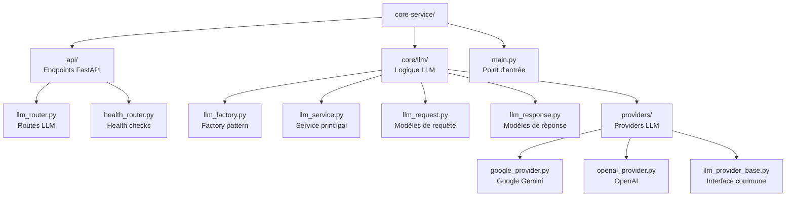
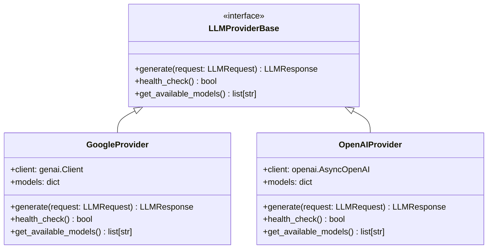

# Core Service - Infrastructure LLM

Service d'infrastructure pour la génération de texte utilisant des modèles de langage (LLM) avec support Google Search et Google Maps grounding.

## 📋 Description

Le Core Service fournit une interface unifiée pour l'utilisation de différents providers LLM :
- **Google Gemini** (modèles 2.5) avec Google Search et Google Maps grounding
- **OpenAI** (GPT-4, GPT-3.5-turbo)
- **Module Shared** : Utilise le package partagé pour CORS, Health checks, Logging, Auth service-to-service

## 🏗️ Architecture Interne



## 🚀 API Endpoints

### Génération de Texte

#### POST `/llm/generate`

Génère du texte en utilisant un provider LLM spécifié.

**Paramètres :**
```json
{
  "prompt": "Votre prompt ici",
  "provider": "google",           // "google" ou "openai"
  "model": "gemini-2.5-flash-lite", // Modèle spécifique
  "temperature": 0.7,             // Créativité (0.0-1.0)
  "max_tokens": 1000,             // Limite de tokens
  "system_message": "Contexte",   // Message système
  "use_search": true,             // Google Search grounding (Gemini uniquement)
  "use_maps": false,              // Google Maps grounding (Gemini uniquement)
  "stream": false                 // Streaming (non supporté actuellement)
}
```

**Réponse :**
```json
{
  "text": "Réponse générée par l'IA",
  "provider": "google",
  "model": "gemini-2.5-flash-lite",
  "usage": {
    "prompt_tokens": 50,
    "completion_tokens": 200,
    "total_tokens": 250
  },
  "finish_reason": "stop",
  "metadata": {
    "search_enabled": true,
    "maps_enabled": false,
    "grounding_metadata": {
      "grounding_support": "enabled",
      "search_queries": ["query1", "query2"],
      "maps_queries": []
    }
  }
}
```

### Informations sur les Providers

#### GET `/llm/providers`

Retourne la liste des providers disponibles.

**Réponse :**
```json
{
  "google": {
    "name": "Google Gemini",
    "models": ["gemini-2.5-flash-lite", "gemini-2.5-flash", "gemini-3-flash-preview"]
  },
  "openai": {
    "name": "OpenAI",
    "models": ["gpt-4", "gpt-3.5-turbo"]
  }
}
```

#### GET `/llm/models`

Retourne les modèles disponibles pour un provider spécifique.

**Paramètres :**
- `provider` (query, optionnel) : Provider spécifique

**Réponse :**
```json
{
  "google": ["gemini-2.5-flash-lite", "gemini-2.5-flash", "gemini-3-flash-preview"],
  "openai": ["gpt-4", "gpt-3.5-turbo"]
}
```

### Health Checks

#### GET `/health`

Health check basique.

#### GET `/health/detailed`

Health check détaillé incluant le statut des providers LLM.

## 🔧 Configuration

### Module Shared

Le Core Service utilise le package `shared` pour :
- **CORS** : Configuration CORS sécurisée et adaptée à l'environnement
- **Health checks** : Endpoints de santé standardisés avec vérification des dépendances
- **Logging** : Logs structurés (JSON en production, pretty en développement)
- **Auth service-to-service** : Authentification JWT sécurisée pour la communication inter-services
- **Configuration** : Settings type-safe avec Pydantic

Voir [shared/README.md](../shared/README.md) pour plus de détails.

### Variables d'Environnement

| Variable | Description | Obligatoire |
|----------|-------------|-------------|
| `GOOGLE_API_KEY` | Clé API Google Gemini | Oui |
| `OPENAI_API_KEY` | Clé API OpenAI | Non |
| `SERVICE_SECRET` | Secret pour authentification service-to-service | Oui |

### Configuration Google Gemini

1. Obtenir une clé API sur [Google AI Studio](https://makersuite.google.com/app/apikey)
2. Configurer `GOOGLE_API_KEY` dans l'environnement
3. Le service utilise automatiquement la nouvelle API `google.genai`

## 🤖 Providers Supportés

### Google Gemini

**Modèles disponibles :**
- `gemini-2.5-flash-lite` (par défaut) - Rapide et économique
- `gemini-2.5-flash` - Équilibré vitesse/qualité
- `gemini-3-flash-preview` - Qualité maximale

**Fonctionnalités spéciales :**
- **Google Search grounding** : `use_search=true` pour accéder aux données web en temps réel
- **Google Maps grounding** : `use_maps=true` pour les informations géographiques

**Exemple avec Google Search :**
```bash
curl -X POST http://localhost:8001/llm/generate \
  -H "Content-Type: application/json" \
  -d '{
    "prompt": "Recherche les dernières informations sur Decathlon Lyon",
    "provider": "google",
    "model": "gemini-2.5-flash-lite",
    "use_search": true,
    "temperature": 0.3
  }'
```

### OpenAI

**Modèles disponibles :**
- `gpt-4` - Modèle le plus avancé
- `gpt-3.5-turbo` - Rapide et économique

**Note :** OpenAI ne supporte pas le grounding (use_search/use_maps).

## 📊 Exemples d'Utilisation

### 1. Génération Simple

```bash
curl -X POST http://localhost:8001/llm/generate \
  -H "Content-Type: application/json" \
  -d '{
    "prompt": "Explique-moi ce qu'est l'intelligence artificielle",
    "provider": "google",
    "model": "gemini-2.5-flash-lite"
  }'
```

### 2. Avec Google Search Grounding

```bash
curl -X POST http://localhost:8001/llm/generate \
  -H "Content-Type: application/json" \
  -d '{
    "prompt": "Trouve les dernières informations sur les développements en IA en 2024",
    "provider": "google",
    "model": "gemini-2.5-flash-lite",
    "use_search": true,
    "temperature": 0.3
  }'
```

### 3. Avec Google Maps Grounding

```bash
curl -X POST http://localhost:8001/llm/generate \
  -H "Content-Type: application/json" \
  -d '{
    "prompt": "Trouve des restaurants près de la Tour Eiffel à Paris",
    "provider": "google",
    "model": "gemini-2.5-flash-lite",
    "use_maps": true,
    "temperature": 0.3
  }'
```

### 4. Avec OpenAI

```bash
curl -X POST http://localhost:8001/llm/generate \
  -H "Content-Type: application/json" \
  -d '{
    "prompt": "Analyse les avantages de l'IA dans l'éducation",
    "provider": "openai",
    "model": "gpt-4",
    "temperature": 0.7
  }'
```

## 🔍 Health Checks

### Vérifier le statut des providers

```bash
curl http://localhost:8001/llm/health
```

### Health check détaillé

```bash
curl http://localhost:8001/health/detailed
```

## 🛠️ Développement

### Structure des Providers



### Ajout d'un nouveau provider

1. Créer un nouveau fichier dans `providers/`
2. Hériter de `LLMProviderBase`
3. Implémenter les méthodes requises
4. Enregistrer dans `llm_factory.py`

## 📈 Monitoring

### Logs

```bash
# Logs du Core Service
docker logs -f novialoom-core
```

### Métriques

Le service expose des métriques via les réponses :
- Usage des tokens
- Temps de réponse
- Statut des providers
- Grounding metadata (Google uniquement)

## 🚨 Gestion d'Erreurs

### Erreurs communes

- **401 UNAUTHENTICATED** : Clé API invalide
- **422 Validation Error** : Paramètres invalides
- **500 Internal Server Error** : Erreur du provider LLM

### Fallback

En cas d'erreur avec un provider, le service peut basculer automatiquement vers un provider de secours (si configuré).

---

**Core Service** - Infrastructure LLM robuste avec support Google Search et Google Maps grounding.
