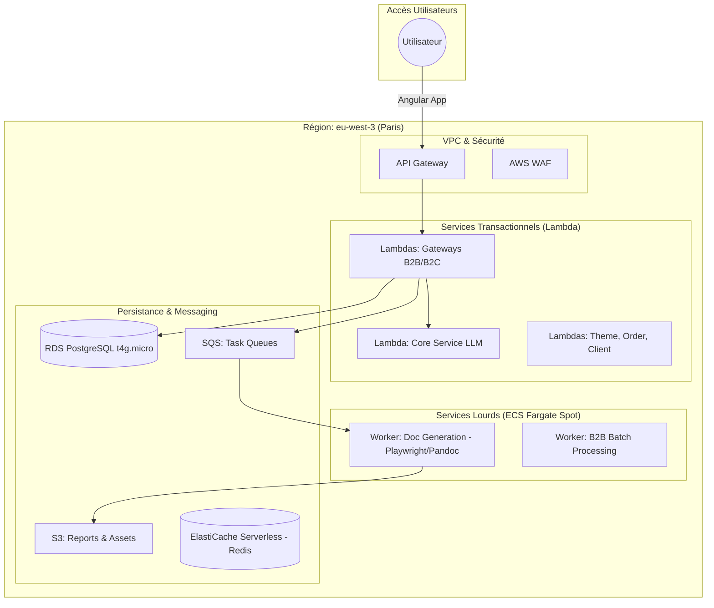

# Spécification Technique : Migration AWS (v3.6)

## 1. Vision et Objectifs
Migration de l'infrastructure Docker locale/hybride vers un écosystème AWS natif, managé et à bas coût.
*   **Région** : `eu-west-3` (Paris)
*   **Approche** : Serverless First + Hybride ECS Fargate Spot
*   **Infrastructure as Code** : AWS CDK (Python)

## 2. Architecture Cible

### 2.1 Schéma Global

## 3. Choix Technologiques & Coûts

| Composant | Solution AWS | Type d'instance / Capacité | Justification |
| :--- | :--- | :--- | :--- |
| **Compute API** | **AWS Lambda** | 128MB - 1GB RAM | Pay-per-use, coût $0 sans trafic. |
| **Compute Lourd** | **ECS Fargate Spot** | 1 vCPU / 2GB RAM | 70% moins cher que le standard. |
| **Base de Données** | **RDS PostgreSQL** | `db.t4g.micro` | ~12$/mois. Transition facile vers Aurora Serverless v2 ultérieurement. |
| **Messaging** | **AWS SQS** | Standard Queues | Scalabilité infinie, premier million de requêtes gratuit. |
| **Storage** | **AWS S3** | Standard / Intelligent Tiering | Remplacement de Scaleway/Local. |
| **Cache** | **ElastiCache Serverless** | Redis | Zéro gestion d'instance, paiement au stockage. |

## 4. Déploiement CI/CD (GitHub Actions)

*   **GitHub Actions** : Orchestrateur du déploiement.
*   **OIDC Connection** : Connexion sécurisée sans clés permanentes via un IAM Role.
*   **AWS CDK** : Déploiement via `cdk deploy` en Python.
*   **Versionnement** : Lambda Versions & Aliases pour faciliter les rollbacks.

## 5. Sécurité

*   **VPC** : Isolement des ressources critiques (RDS, Redis, ECS) dans des sous-réseaux privés sans accès direct internet.
*   **Secrets Manager** : Stockage sécurisé des clés API (Gemini, Stripe, etc.).
*   **IAM Roles** : Principe du moindre privilège pour chaque service.
*   **WAF** : Protection de l'API Gateway contre les attaques courantes (OWASP Top 10).

## 6. Phase de Transition

1.  Initialisation du projet **AWS CDK** (Python).
2.  Déploiement du **VPC** et de la **Base de Données RDS**.
3.  Migration des données PostgreSQL.
4.  Packaging et déploiement des **Lambdas** (API Gateway).
5.  Déploiement des **Workers ECS Fargate Spot**.
6.  Bascule du Frontend Angular vers **S3 + CloudFront**.

